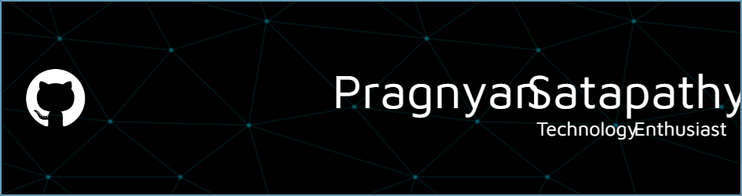

<h1 align="center">Hey there 👋, I'm Pragnyan Satapathy</h1>
<h3 align="center">🚀 Tech Enthusiast | 🤖 AI & IoT Dev | 🌐 Full-Stack Engineer | 📍 Bengaluru, India</h3>

  

  
  
  

---

## 🧠 About Me

🎓 **B.Tech in Computer Science** – Presidency University  
💡 Passionate about **AI**, **IoT**, **Embedded Systems**, and building **full-stack web apps**  
🧰 Obsessed with solving real-world problems through tech  
🔭 Currently diving into **Generative AI**, **Edge Computing**, and **Cloud Architectures**

---

## 🚀 Tech Stack

<table>
  <tr>
    <td></td>
  </tr>
  <tr>
    <td></td>
  </tr>
  <tr>
    <td></td>
  </tr>
  <tr>
    <td></td>
  </tr>
</table>

---

## 📌 Featured Projects

🔡 **SignSpeak-AI**  
> 👋 Converts sign language into text/speech using **CNN**, **LSTM**, **OpenCV**  
> 🌍 Future-ready with multilingual support & voice-to-sign translation

🩺 **CareCast – AI Health Predictor**  
> 🧠 Uses health history & ML to predict disease risk  
> 🚑 Delivers proactive alerts and lifestyle suggestions
> [CareCast](https://care-cast-predictions.vercel.app/)

🚦 **Smart Traffic Management System**  
> ⚙️ Edge AI with dynamic signal optimization  
> 📊 Real-time traffic analytics for smarter urban planning

📄 **Published Work:**  
📰 _Real-Time Queue Detection_ – [IJSREM Journal (2025)](https://www.doi.org/10.55041/IJSREM40695)

---

## 🏆 Achievements

🏅 **Winner** – Smart India Hackathon 2023 (Internal Rounds)  
🥈 **Runner-up** – SCIMIT 2024 Project Expo  
🥉 **3rd Place** – Prajwalan 2k24 Hackathon  
🎖️ **Finalist** – InnovateX @ IISc Bengaluru  
🏸 **Athlete** – KVS National Level Badminton Player

---

## 📫 Get in Touch

- 📧 **Email:** [pragnyansatapathy@gmail.com](mailto:pragnyansatapathy@gmail.com)  
- 📍 **Location:** Bengaluru, India  
- 📞 **Phone:** +91-7829465164  
- 🔗 **LinkedIn:** [Connect Here](https://www.linkedin.com/in/pragnyan)

---

  
   
  ✨ _“Passionate about learning, building, and creating tech that matters.”_ ✨
   
  

