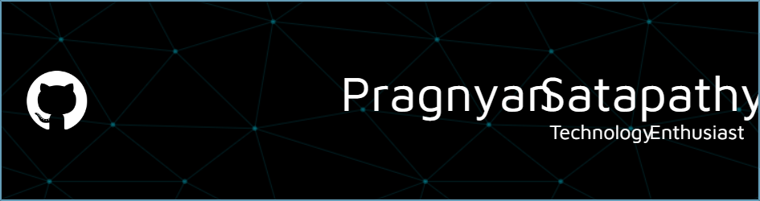

## 👋 Hello, I'm Pragnyan Satapathy

🎓 Computer Science Graduate | AI & ML Research Enthusiast  
💡 Interested in building intelligent systems that work reliably in real-world environments  
🚀 Exploring the intersection of **AI, Computer Vision, Cybersecurity, and SaaS engineering**

---

## 🌟 About Me

I’m passionate about **applied AI and system-level problem solving** — turning research ideas into usable, scalable solutions.

My interests span **machine learning, vision systems, and data-driven applications**, with a strong focus on explainability and real-world constraints. Alongside research-oriented work, I also enjoy building **modern web applications and SaaS dashboards** that bring these ideas to life.

🔬 Currently working on **vision-based queue detection & crowd analysis**  
🧠 Experience with **ML-driven security systems and deepfake detection**  
⚙️ Building **AI-powered MVPs and analytics dashboards**  
🌐 Open to **research collaboration, freelance projects, and startup MVPs**

---

## 🛠️ Skills & Tools

**Programming:**  
Python, Java, JavaScript, C/C++

**AI / ML & Vision:**  
PyTorch, TensorFlow, YOLO, OpenCV, Scikit-learn

**Web & SaaS:**  
React, Next.js, Tailwind CSS, Node.js

**Systems & Tools:**  
Docker, Linux, PostgreSQL, MongoDB, Git/GitHub

---

## 📌 Featured Projects

🛡️ **ML-Based Network Intrusion Detection System**  
Applied machine learning on real-world traffic for security monitoring.

🚦 **Real-Time Queue Detection & Management**  
YOLO-based vision system for crowd analytics — *published research*.

🚗 **GPS & OBD-II Trip Visualization**  
Spatio-temporal vehicle analytics with 2D/3D route visualization.

🧬 **Physio-Aware Deepfake Detection**  
Physiology-driven approach using rPPG signals.

🤖 **NovaWrite AI**  
AI-style content generation MVP with modern SaaS UX.  
🌐 https://novawrite-ai.vercel.app

📊 **PulseMetrics Dashboard**  
SaaS analytics dashboard focused on KPI storytelling.  
🌐 https://pulsemetrics-dashboard.vercel.app

---

## 🌱 What Drives Me

I believe good systems are not just accurate — they are **robust, interpretable, and useful in practice**.

My goal is to continue growing in **AI research and intelligent system design**, while collaborating with people who care about solving meaningful problems.

> *“Build systems that survive outside the lab.”*

---

## 📫 Let’s Connect

📧 Email: pragnyansatapathy@gmail.com  
💼 LinkedIn: https://www.linkedin.com/in/pragnyan  
🌐 Portfolio: https://portfolio-dnum.vercel.app/

---

  

